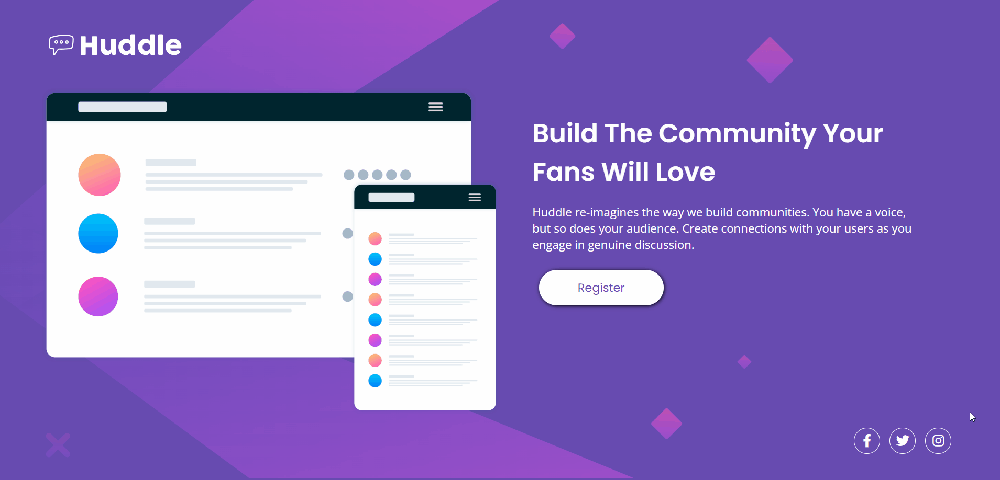

# QUEST HTML E CSS AVANÇADO - FRONTEND MENTOR - PROJETO HUDDLE

[](https://rrsf95.github.io/quest-css-html-avancado/)


## DESCRIÇÃO ✔
Desafio do FrontEnd Mentor - Huddle landing page with a single introductory section.
<br> Este desafio foi utilizado para a avaliação do módulo final de HTML e CSS Avançado do curso DEVQUEST.

## FUNCIONALIDADES DO PROJETO ⚙
O projeto se baseia em uma landing page responsiva para desktop e mobile.

## TECNOLOGIAS UTILIZADAS 💻
- HTML
- CSS

Para este projeto foi utilizado HTML e CSS, por meio do Grid e Flexbox foram executadas todas as estilizações da estrutura criada pelo  HTML;

## COMO UTILIZAR 🛠
Clone o projeto do repositório para uma melhor compreensão do código;

```
git clone https://github.com/RRSF95/quest-css-html-avancado.git
```

Caso queira somente visualizar a página, pode visitar o link abaixo:

https://rrsf95.github.io/quest-css-html-avancado/
## STATUS DO PROJETO 🏆
O projeto já está finalizado.


